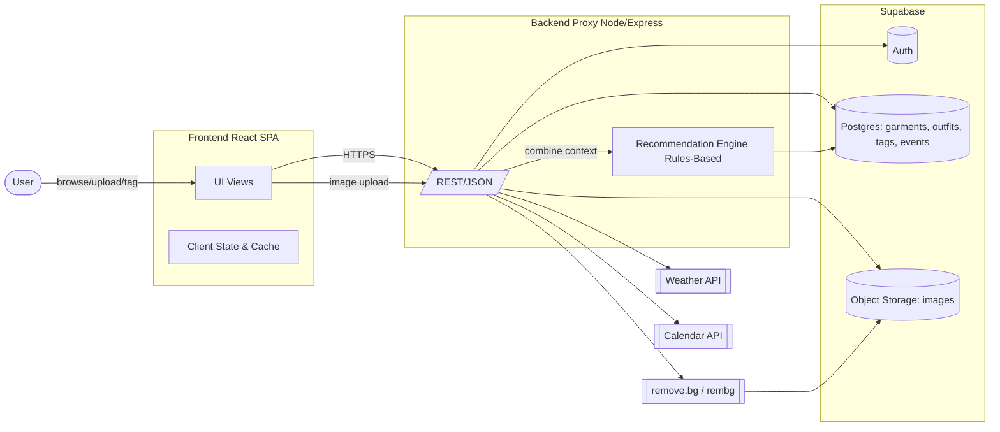

```mermaid
flowchart LR
  User([User])
  subgraph Client["Frontend React SPA"]
    UI[UI Views]
    State[Client State & Cache]
  end
  subgraph Edge["Backend Proxy Node/Express"]
    API[/REST/JSON/]
    Rules["Recommendation Engine Rules-Based"]
  end
  subgraph Data[Supabase]
    Auth[(Auth)]
    DB[(Postgres: garments, outfits, tags, events)]
    Store[(Object Storage: images)]
  end
  Weather[[Weather API]]
  Cal[[Calendar API]]
  RemoveBG[[remove.bg / rembg]]

  User -- browse/upload/tag --> UI
  UI -- HTTPS --> API
  API --> Auth
  API --> DB
  API --> Store
  API --> Weather
  API --> Cal
  UI -- image upload --> API --> RemoveBG --> Store
  API -- combine context --> Rules --> DB
```