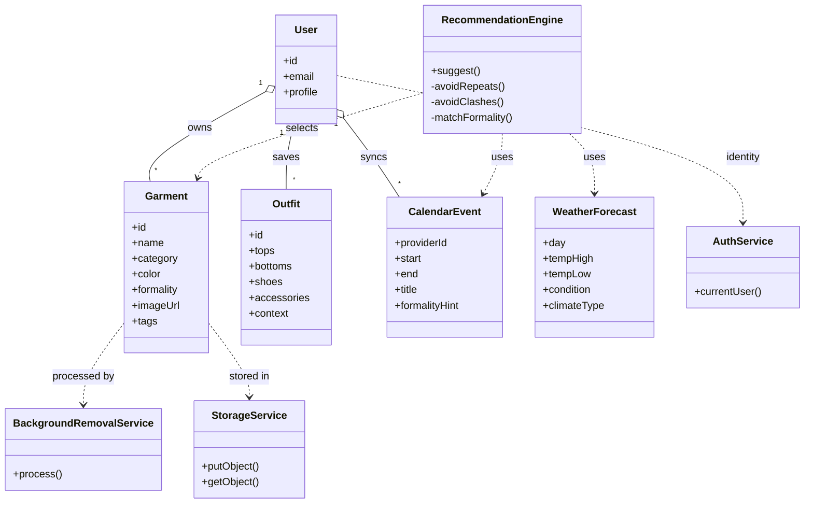

```mermaid
classDiagram
  class User {
    +id
    +email
    +profile
  }
  class Garment {
    +id
    +name
    +category
    +color
    +formality
    +imageUrl
    +tags
  }
  class Outfit {
    +id
    +tops
    +bottoms
    +shoes
    +accessories
    +context
  }
  class CalendarEvent {
    +providerId
    +start
    +end
    +title
    +formalityHint
  }
  class WeatherForecast {
    +day
    +tempHigh
    +tempLow
    +condition
    +climateType
  }
  class RecommendationEngine {
    +suggest()
    -avoidRepeats()
    -avoidClashes()
    -matchFormality()
  }
  class BackgroundRemovalService {
    +process()
  }
  class StorageService {
    +putObject()
    +getObject()
  }
  class AuthService {
    +currentUser()
  }

  User "1" o-- "*" Garment : owns
  User "1" o-- "*" Outfit : saves
  User "1" o-- "*" CalendarEvent : syncs
  RecommendationEngine ..> WeatherForecast : uses
  RecommendationEngine ..> CalendarEvent : uses
  RecommendationEngine ..> Garment : selects
  Garment ..> BackgroundRemovalService : processed by
  Garment ..> StorageService : stored in
  User ..> AuthService : identity
```