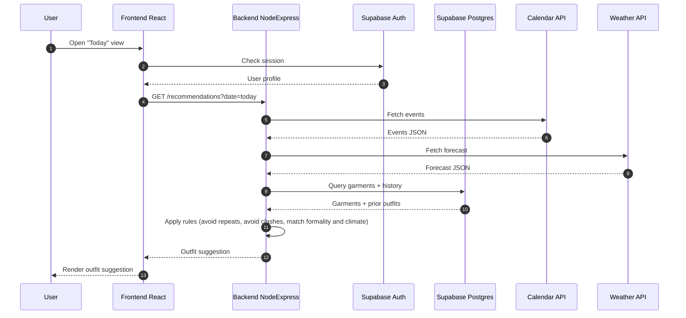

```mermaid
sequenceDiagram
  autonumber
  participant U as User
  participant FE as Frontend React
  participant BE as Backend NodeExpress
  participant AUTH as Supabase Auth
  participant DB as Supabase Postgres
  participant CAL as Calendar API
  participant WX as Weather API

  U->>FE: Open "Today" view
  FE->>AUTH: Check session
  AUTH-->>FE: User profile
  FE->>BE: GET /recommendations?date=today
  BE->>CAL: Fetch events
  CAL-->>BE: Events JSON
  BE->>WX: Fetch forecast
  WX-->>BE: Forecast JSON
  BE->>DB: Query garments + history
  DB-->>BE: Garments + prior outfits
  BE->>BE: Apply rules (avoid repeats, avoid clashes, match formality and climate)
  BE-->>FE: Outfit suggestion
  FE-->>U: Render outfit suggestion
```