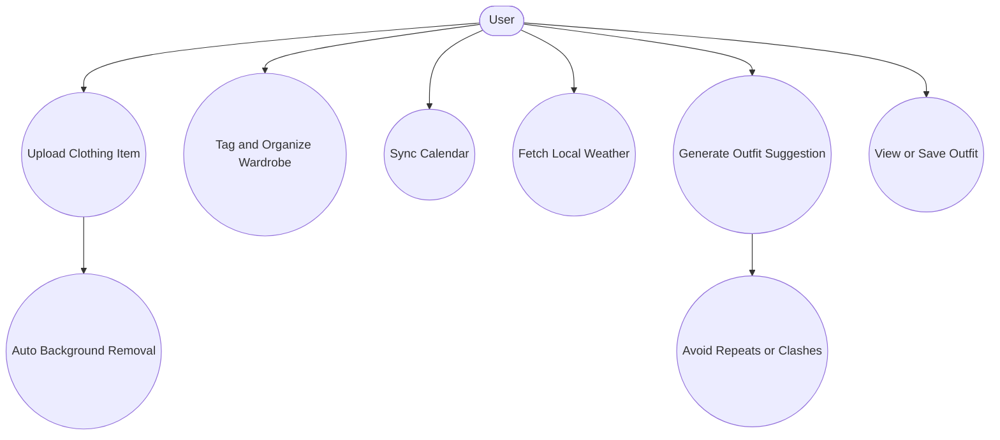

```mermaid
flowchart TB
  User([User])

  UC1((Upload Clothing Item))
  UC2((Auto Background Removal))
  UC3((Tag and Organize Wardrobe))
  UC4((Sync Calendar))
  UC5((Fetch Local Weather))
  UC6((Generate Outfit Suggestion))
  UC7((Avoid Repeats or Clashes))
  UC8((View or Save Outfit))

  User --> UC1
  UC1 --> UC2
  User --> UC3
  User --> UC4
  User --> UC5
  User --> UC6
  UC6 --> UC7
  User --> UC8
```
